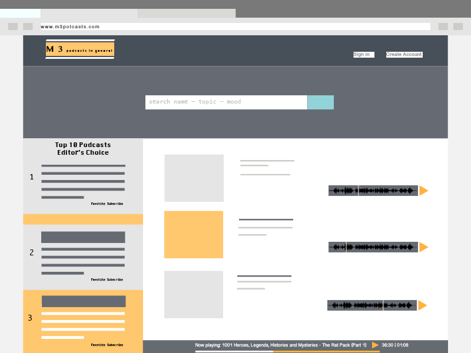
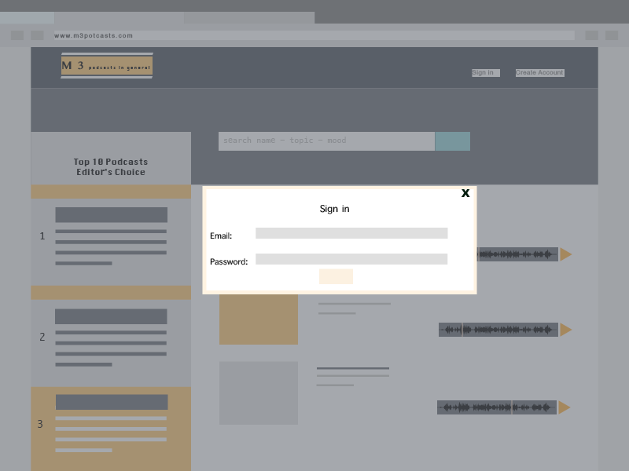
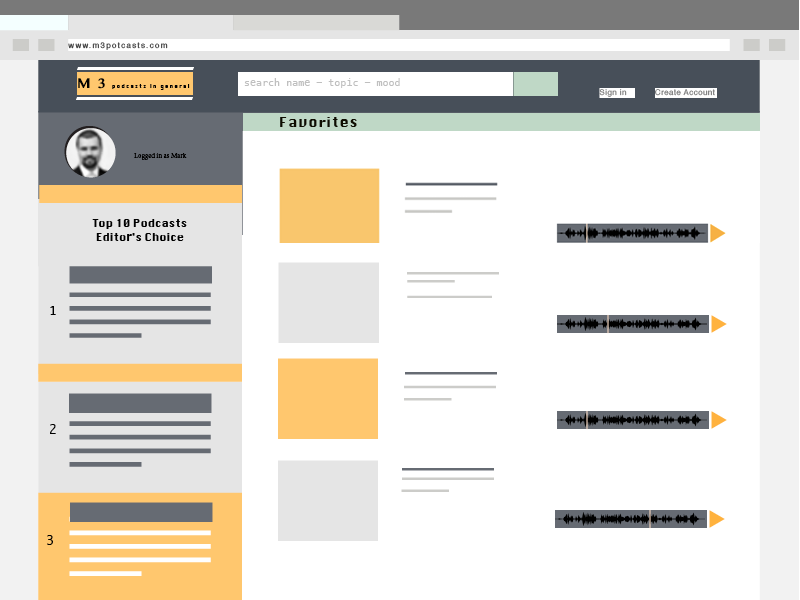
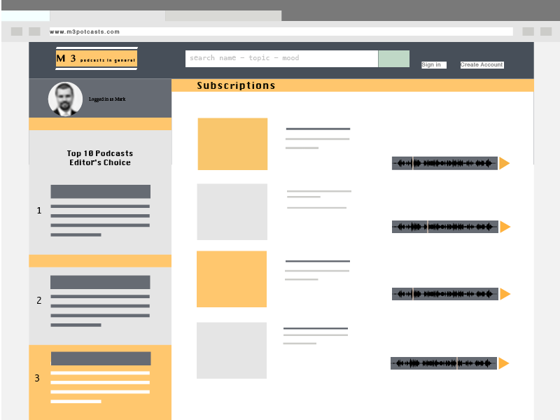

# Podcast App

# Create React Express App (Developer Notes)

## About This Boilerplate

This setup allows for a Node/Express/React app which can be easily deployed to Heroku.

The front-end React app will auto-reload as it's updated via webpack dev server, and the backend Express app will auto-reload independently with nodemon.

## Wireframes

### Home Page


### Login Page


### Favorites


### Subscribed



## Starting the app locally

Start by installing front and backend dependencies. While in this directory, run the following commands:

```
yarn install
cd client
yarn install
cd ..
```

After both installations complete, run the following command in your terminal:

```
yarn start
```

That's it, your app should be running on <http://localhost:3000>. The Express server should intercept any AJAX requests from the client.

## Deployment (Heroku)

After confirming that you have an up to date git repository and a Heroku app created, complete the following:

1. Build the React app for production by running the following command:

```
yarn build
```
> Note: A yarn build will be required to register any new Post requests from any front-end JavaScript to to prevent any proxy server errors.

2. Add and commit all changes to git

3. Push to Heroku

If all previous steps were followed correctly, your application should be deployed to Heroku!
